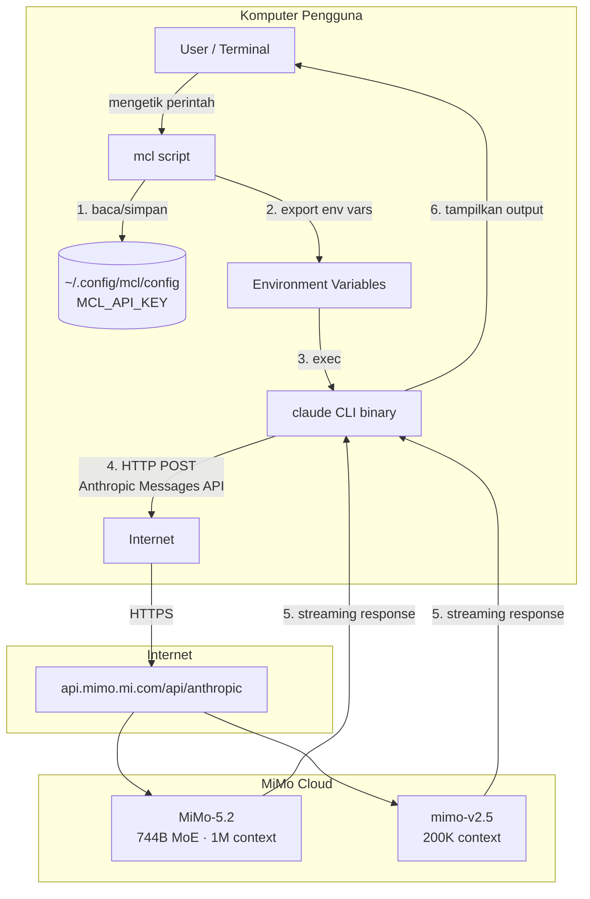
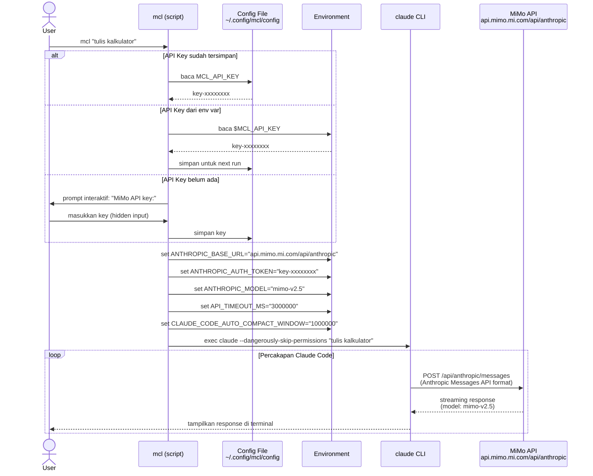
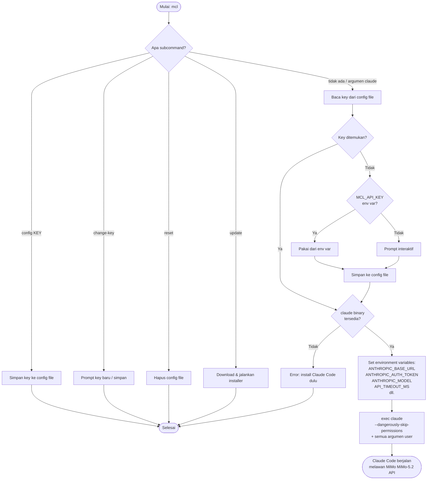
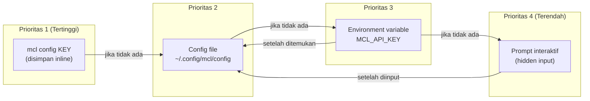
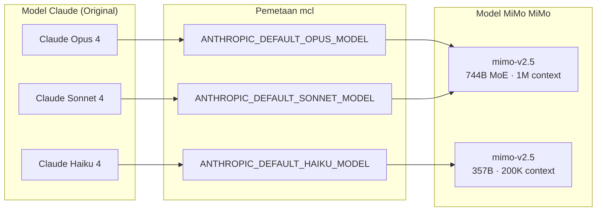
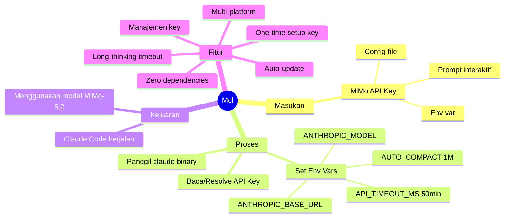

# 🔀 Mcl

> Jalankan [Claude Code](https://docs.claude.com/en/docs/claude-code) menggunakan
> [MiMo MiMo-5.2](https://mimo.mi.com) API yang kompatibel dengan protokol Anthropic.

---

## 📖 Daftar Isi

- [Bagaimana Cara Kerjanya?](#-bagaimana-cara-kerjanya)
- [Arsitektur Sistem](#-arsitektur-sistem)
- [Diagram Alir (Flowchart)](#-diagram-alir-flowchart)
- [Alur Resolusi API Key](#-alur-resolusi-api-key)
- [Flags & Subcommands Lengkap](#-flags--subcommands-lengkap)
- [Environment Variables](#-environment-variables)
- [Kustomisasi Model](#-kustomisasi-model)
- [Safe Mode](#-safe-mode)
- [Instalasi](#-instalasi)
- [Penggunaan](#-penggunaan)
- [Manajemen Kunci API](#-manajemen-kunci-api)
- [Update & Uninstall](#-update--uninstall)
- [Keamanan](#-keamanan)
- [Development](#-development)

---

## 🧠 Bagaimana Cara Kerjanya?

### Konsep Inti

Claude Code adalah CLI resmi dari Anthropic yang secara default berkomunikasi dengan
API Anthropic (`https://api.anthropic.com`). Namun, Claude Code mendukung
**penggantian base URL** melalui environment variable `ANTHROPIC_BASE_URL`.

MiMo menyediakan endpoint yang **kompatibel dengan protokol Anthropic** di:

```
https://api.mimo.mi.com/api/anthropic
```

Artinya, MiMo "berpura-pura" menjadi server Anthropic — menerima request
berformat Anthropic Messages API, memprosesnya dengan model MiMo-5.2, dan
mengembalikan response dalam format yang sama persis seperti yang diharapkan
Claude Code.

**Mcl** adalah **wrapper script** yang menjembatani keduanya dengan cara:

1. 🔑 **Mengambil** MiMo API key (dari config file, env var, atau prompt interaktif)
2. 🌐 **Mengeset** `ANTHROPIC_BASE_URL` ke endpoint MiMo
3. 🎯 **Memetakan** model Claude (Opus/Sonnet/Haiku) ke model MiMo yang sesuai
4. ⏱️ **Mengeset** timeout 50 menit untuk long-thinking tasks MiMo-5.2
5. 🚀 **Menjalankan** binary `claude` dengan environment yang sudah dikonfigurasi

```
┌─────────────┐     Environment Variables      ┌──────────────────────┐
│             │────────────────────────────────▶│                      │
│  mcl        │  ANTHROPIC_BASE_URL             │  claude CLI binary   │
│  (wrapper)  │  ANTHROPIC_AUTH_TOKEN           │  (dari Anthropic)    │
│             │  ANTHROPIC_MODEL                │                      │
└─────────────┘  API_TIMEOUT_MS                 └──────────┬───────────┘
                 CLAUDE_CODE_AUTO_COMPACT_WINDOW           │
                                                    HTTP Request
                                                    (Anthropic Protocol)
                                                           │
                                                           ▼
                                              ┌────────────────────────┐
                                              │  api.mimo.mi.com              │
                                              │  /api/anthropic   │
                                              │                        │
                                              │  Model: mimo-v2.5    │
                                              │  Model: mimo-v2.5    │
                                              └────────────────────────┘
```

### Mengapa Ini Bekerja?

| Komponen | Peran |
|----------|-------|
| **Claude Code CLI** | Binary resmi Anthropic — mengirim request ke API, mengelola tool calls, menampilkan UI terminal |
| **MiMo API** | Menyediakan endpoint `/api/anthropic` yang menerima dan merespon dalam format Anthropic Messages API |
| **Mcl Script** | Shell script tipis yang menyetel env vars sebelum menjalankan `claude` |

Claude Code **tidak tahu** bahwa ia sedang berbicara dengan MiMo, bukan
Anthropic. Dari sudut pandang Claude Code, ia hanya melihat base URL yang
berbeda — protokolnya tetap sama.

---

## 🏗 Arsitektur Sistem

### Diagram Komponen



### Diagram Sequence



---

## 🔄 Diagram Alir (Flowchart)

### Alur Utama Script



---

## 🔑 Alur Resolusi API Key

Prioritas pencarian API key (berurutan):



| Prioritas | Sumber | Keterangan |
|-----------|--------|------------|
| Perintah Tambahan | Fungsi |
|-------------------|--------|
| `mcl model` | Memilih model MiMo secara interaktif |
| `mcl doctor` | Cek status sistem, koneksi, & API key |
| `mcl clean` | Hapus direktori memori `.claude` lokal |
| `mcl alias [c]` | Mendaftarkan shortcut Mcl di Bash/PowerShell |

| Prioritas | Sumber | Keterangan |
|-----------|--------|------------|
| 1 | `mcl config <KEY>` | Diset langsung via CLI, tanpa prompt |
| 2 | `~/.config/mcl/config` | Key yang disimpan dari run sebelumnya |
| 3 | `$MCL_API_KEY` | Environment variable — lalu disimpan otomatis |
| 4 | Prompt interaktif | Ditanyakan jika semua sumber di atas kosong |

---

## 🌍 Environment Variables

### Semua variabel yang di-set oleh Mcl

| Variable | Nilai Default | Fungsi |
|----------|--------------|--------|
| `ANTHROPIC_BASE_URL` | `https://api.mimo.mi.com/api/anthropic` | Mengarahkan Claude Code ke endpoint MiMo |
| `ANTHROPIC_AUTH_TOKEN` | `<MiMo API key>` | Otentikasi ke MiMo API |
| `ANTHROPIC_DEFAULT_OPUS_MODEL` | `mimo-v2.5` | Pengganti Claude Opus 4 |
| `ANTHROPIC_DEFAULT_SONNET_MODEL` | `mimo-v2.5` | Pengganti Claude Sonnet 4 |
| `ANTHROPIC_DEFAULT_HAIKU_MODEL` | `mimo-v2.5` | Pengganti Claude Haiku |
| `API_TIMEOUT_MS` | `3000000` | Timeout 50 menit — untuk long-thinking MiMo-5.2 |
| `ANTHROPIC_MODEL` | `<OPUS_SONNET>` | Model eksplisit — membantu stabilitas streaming |
| `CLAUDE_CODE_AUTO_COMPACT_WINDOW` | `1000000` | Auto-compact 1M — cocok context MiMo-5.2 |

> ⚠️ `ANTHROPIC_MODEL` diset ke nilai yang sama dengan `DEFAULT_OPUS_MODEL`
> untuk memastikan Claude Code mengirim model ID yang tepat. Effort reasoning
> diatur via command `/effort` di dalam Claude Code session.
>
> ⚠️ `API_TIMEOUT_MS=3000000` (50 menit) direkomendasikan oleh MiMo untuk
> menghindari request yang terputus saat long-thinking.

### Pemetaan Model Claude → MiMo



> **Catatan:** Mengikuti rekomendasi resmi MiMo. MiMo-5.2 untuk task berat
> (Opus/Sonnet), MiMo-4.7 untuk task ringan (Haiku). Gunakan `/effort` di
> dalam session Claude Code untuk mengatur reasoning effort.

### Variabel yang dibaca oleh Mcl (bisa di-set user)

| Variable | Fungsi |
|----------|--------|
| `MCL_API_KEY` | API key MiMo (auto-disimpan saat pertama digunakan) |
| `MCL_OPUS_SONNET_MODEL` | Override model Opus/Sonnet |
| `MCL_HAIKU_MODEL` | Override model Haiku |
| `MCL_TIMEOUT_MS` | Override API timeout (default: 3000000) |
| `MCL_AUTO_COMPACT` | Override auto-compact window (default: 1000000) |
| `MCL_SAFE=1` | Sama dengan flag `--safe` |
| `MCL_VERBOSE=1` | Sama dengan flag `--verbose` |

---

## 🎮 Flags & Subcommands Lengkap

### Flags (mcl sendiri)

| Flag | Deskripsi |
|------|-----------|
| `--help`, `help`, `-h` | Tampilkan bantuan mcl |
| `--version` | Tampilkan versi mcl |
| `--dry-run` | Cetak apa yang akan dieksekusi, tanpa menjalankan Claude Code |
| `--verbose` | Aktifkan mode debug (setara dengan `MCL_VERBOSE=1`) |
| `--safe` | Jalankan **tanpa** `--dangerously-skip-permissions` |
| `--` | Semua argumen setelah `--` diteruskan langsung ke `claude` |

### Subcommands

| Subcommand | Deskripsi |
|------------|-----------|
| `config [KEY]` | Simpan/ganti API key (inline atau prompt) |
| `change-key [KEY]` | Alias untuk `config` |
| `reset` | Hapus API key yang tersimpan |
| `update` | Update ke versi terbaru |
| `verify` | Verifikasi API key terhadap MiMo API |
| `show-config` | Tampilkan konfigurasi saat ini (key dimasking) |

### Contoh Penggunaan Flags

```bash
mcl --help                          # Lihat bantuan mcl
mcl --version                       # Lihat versi
mcl --dry-run                       # Preview tanpa eksekusi
mcl --dry-run --verbose             # Preview dengan info debug
mcl --safe "hapus file lama"        # Jalankan dengan permission prompt
mcl -- --help                       # Teruskan --help ke claude (bukan mcl)
mcl --safe --verbose "prompt"       # Gabungkan beberapa flag
```

---

## 🎨 Kustomisasi Model

Kamu bisa mengganti model MiMo yang digunakan melalui **config file** atau
**environment variable**. Konfigurasi di-resolve dengan prioritas:

```
Environment Variable > Config File > Default Bawaan
```

### Via Config File

Edit `~/.config/mcl/config`:

```ini
MCL_API_KEY=your-id.your-secret
MCL_OPUS_SONNET_MODEL=mimo-v2.5
MCL_HAIKU_MODEL=mimo-v2.5
MCL_TIMEOUT_MS=3000000
MCL_AUTO_COMPACT=1000000
MCL_SAFE=0
```

### Via Environment Variable (per-sesi)

```bash
# Override model Opus/Sonnet untuk satu sesi
MCL_OPUS_SONNET_MODEL="mimo-v2.5" mcl "tulis kode"

# Override Haiku model
MCL_HAIKU_MODEL="mimo-v2.5" mcl --safe "review dokumentasi"
```

### Mengganti Model secara Interaktif

Mcl menyediakan subcommand `model` yang memudahkan Anda memilih model MiMo secara interaktif, tanpa perlu mengedit config secara manual.

```bash
mcl model
```
Perintah ini akan memunculkan daftar model yang tersedia, Anda cukup mengetikkan angkanya, dan Mcl akan otomatis menyimpan pilihan tersebut sebagai model default di file config.

### Model MiMo yang Tersedia (untuk Coding)

| Model ID | Karakteristik | Context |
|----------|--------------|---------|
| `mimo-v2.5` | **Flagship**, reasoning terkuat, 1M context | 1M |
| `glm-5.2` | Varian tanpa suffix [1m], standar 1M context | 1M |
| `glm-5.1` | Generasi model flagship sebelumnya | 200K |
| `glm-5` | Model standar generasi 5 | 200K |
| `glm-5-turbo` | Model MiMo-5 berkecepatan tinggi | 200K |
| `mimo-v2.5` | Model hemat & sangat cepat (30B), alternatif ringan | 200K |
| `glm-4.6` | Model ringan generasi ke-4 | 200K |
| `glm-4.5` | Model seimbang generasi ke-4 | 200K |
| `glm-4-32b-0414-128k` | Varian khusus open-weight | 128K |
| `MiMo-4.7-Flash` | **Gratis** (30B), untuk task super ringan | 200K |

> Cek [mimo.mi.com/model-api](https://mimo.mi.com/model-api) dan [docs.mimo.mi.com](https://docs.mimo.mi.com/guides/overview/pricing)
> untuk model terbaru.

---

## 🛡️ Safe Mode

Secara default, Mcl menjalankan Claude Code dengan flag
`--dangerously-skip-permissions` — artinya tool call berjalan **tanpa konfirmasi**.
Ini nyaman tapi berisiko di direktori yang tidak kamu percayai.

**Safe Mode** menonaktifkan flag tersebut, sehingga setiap tindakan (shell command,
file edit) akan meminta persetujuanmu terlebih dahulu.

### Cara mengaktifkan

```bash
# Opsi 1: Flag --safe
mcl --safe "hapus semua file cache"

# Opsi 2: Environment variable
MCL_SAFE=1 mcl

# Opsi 3: Config file (permanen)
echo "MCL_SAFE=1" >> ~/.config/mcl/config
```

### Kapan menggunakan Safe Mode?

| Situasi | Rekomendasi |
|---------|-------------|
| Direktori project sendiri | Non-safe (default) |
| Direktori tidak dikenal | **Safe Mode** |
| Operasi destruktif (rm, drop table) | **Safe Mode** |
| CI/CD pipeline | Non-safe (pakai env var) |
| Pertama kali mencoba mcl | **Safe Mode** |

---

## 📦 Instalasi

> **Prasyarat:** [Claude Code CLI](https://docs.claude.com/en/docs/claude-code)
> harus sudah terinstal.

### macOS / Linux

```bash
curl -fsSL https://raw.githubusercontent.com/Muhira007/z-ai-claude/main/install.sh | bash
```

Menginstal script `mcl` ke `~/.local/bin`. Jika direktori tersebut belum
ada di `PATH`, installer akan memberi tahu baris yang perlu ditambahkan ke
`~/.bashrc` atau `~/.zshrc`.

### Windows (PowerShell)

```powershell
irm https://raw.githubusercontent.com/Muhira007/z-ai-claude/main/install.ps1 | iex
```

> Di Windows kamu juga bisa menggunakan command macOS/Linux di atas dari
> **Git Bash** atau **WSL**.

---

## 🚀 Penggunaan

Jalankan pertama kali — akan diminta MiMo API key (input tersembunyi):

```bash
mcl
```

Setelah itu, semua argumen diteruskan langsung ke `claude`:

```bash
mcl "jelaskan cara kerja Docker Compose"
mcl --help
mcl "refactor module auth menjadi lebih clean"
```

### Cara mendapatkan MiMo API Key

1. **Buat akun** di [mimo.mi.com](https://mimo.mi.com) — klik **Sign Up** dan lengkapi pendaftaran
2. Setelah akun aktif, buka [mimo.mi.com/manage-apikey/apikey-list](https://mimo.mi.com/manage-apikey/apikey-list)
3. Klik **"Buat API Key baru"** (atau "Create new API key")
4. Platform akan menampilkan dua informasi:
   - **API Key ID** — 32 karakter hex (contoh: `a1b2c3d4e5f6a7b8c9d0e1f2a3b4c5d6`)
   - **API Key** — gabungan `{API Key ID}.{secret}` (contoh: `a1b2c3d4...c5d6.AbCdEfGhIjKlMnOpQrStUvWxYz112233`)
5. **Salin API Key lengkap** (format `{ID}.{secret}`) — ini yang dibutuhkan `mcl`
6. Masukkan saat prompt `mcl` pertama kali, atau via:
   ```bash
   mcl config "a1b2c3d4e5f6a7b8c9d0e1f2a3b4c5d6.AbCdEfGhIjKlMnOpQrStUvWxYz112233"
   ```

> ⚠️ **Penting:** MiMo akan mendeteksi API key yang terekspos publik dan dapat
> otomatis merotasi/mencabutnya. Simpan key dengan aman, jangan dibagikan di
> browser atau client-side code.
>
> 💡 **MiMo Coding Plan** di [mimo.mi.com/model-api](https://mimo.mi.com/model-api) memberikan
> akses ke endpoint coding khusus (`/api/anthropic`) dengan performa
> optimal untuk Claude Code dan tools serupa.

---

## 🔧 Manajemen Kunci API

```bash
mcl change-key        # ganti kunci tersimpan (prompt interaktif)
mcl change-key KEY    # ganti kunci langsung tanpa prompt
mcl reset             # hapus kunci tersimpan
```

Alias yang diterima: `config`, `set-key`, `change` — semuanya sama dengan `change-key`.

### Lokasi Penyimpanan Key

| Platform      | Path                                     | Permission        |
|---------------|------------------------------------------|-------------------|
| macOS / Linux | `~/.config/mcl/config`                   | `600` (owner only)|
| Windows       | `%APPDATA%\mcl\config`                   | ACL: user only    |

> ⚠️ Key disimpan dalam **plaintext** di mesin lokal. Siapa pun dengan akses ke
> akun user kamu bisa membacanya. Perlakukan seperti kredensial lokal lainnya.

---

## 🔄 Update & Uninstall

### Update ke versi terbaru

```bash
mcl update
```

### Uninstall

**macOS / Linux:**

```bash
rm ~/.local/bin/mcl
rm -rf ~/.config/mcl
```

**Windows (PowerShell):**

```powershell
Remove-Item -Recurse -Force "$env:LOCALAPPDATA\Programs\mcl"
Remove-Item -Recurse -Force "$env:APPDATA\mcl"
```

---

## 🔐 Keamanan

- `--dangerously-skip-permissions` digunakan agar Claude Code berjalan tanpa
  prompt persetujuan per tindakan. **Nyaman, tapi berisiko** — artinya perintah
  shell dan edit file berjalan tanpa konfirmasi. Gunakan di direktori yang
  kamu percayai.
- API key disimpan di local filesystem dengan permission ketat (`chmod 600`).
- Tidak ada data yang dikirim ke server selain ke MiMo API.
- Semua komunikasi menggunakan HTTPS.

---

## 🧩 Ringkasan Visual



---

---

## 👩‍💻 Development

### Struktur Proyek

```
mcl/
├── mcl                     # Script Bash utama (Linux/macOS)
├── mcl.ps1                 # Script PowerShell (Windows)
├── install.sh              # Installer Bash
├── install.ps1             # Installer PowerShell (Windows)
├── completions/            # Shell completions (bash/zsh/fish)
├── tests/                  # BATS test suite
├── .github/workflows/      # CI/CD pipeline
├── Makefile                # Perintah development
├── CONTRIBUTING.md         # Panduan kontribusi
└── README.md               # Dokumentasi
```

### Development Commands

```bash
make check      # Jalankan linting + test
make lint       # ShellCheck saja
make test       # BATS test saja
make install    # Install ke ~/.local/bin (local dev)
make bump       # Bump versi di semua script
make completions # Generate shell completions
```

### CI/CD

GitHub Actions otomatis berjalan untuk setiap push ke `main`:

| Job | Deskripsi |
|-----|-----------|
| **ShellCheck** | Static analysis untuk Bash script |
| **PSScriptAnalyzer** | Static analysis untuk PowerShell |
| **BATS Tests** | Unit & integration test |
| **Smoke Test** | `--help`, `--version`, `--dry-run` |

### Kontribusi

Lihat [CONTRIBUTING.md](CONTRIBUTING.md) untuk panduan lengkap.

---

## ❓ FAQ

### Kenapa tidak ada model "flash" untuk MiMo-5.2?

MiMo-5.2 adalah model flagship MiMo (744B MoE, 40B aktif per token). MiMo belum
merilis varian "flash" untuk generasi 5.2. Untuk task ringan, `mimo-v2.5`
digunakan sebagai alternatif.

### Apa beda endpoint `/api/anthropic` vs `/api/anthropic`?

| Endpoint | Kegunaan |
|----------|----------|
| `/api/anthropic` | General Anthropic Messages API — untuk semua tools |
| `/api/anthropic` | **Coding Plan** khusus — dioptimalkan untuk Claude Code, Cline, dll |

Mcl menggunakan `/api/anthropic` karena dioptimalkan untuk coding.

### Kenapa timeout diset ke 50 menit?

MiMo-5.2 melakukan long-thinking untuk task coding kompleks. Timeout default
Claude Code mungkin terlalu pendek. `API_TIMEOUT_MS=3000000` adalah rekomendasi
resmi dari MiMo.

---

## 📄 Lisensi

MIT — lihat [LICENSE](LICENSE).

---

> Dibuat dengan ❤️ oleh [Muhira007](https://github.com/Muhira007) |
> Dokumentasi diperkaya dengan diagram oleh [Claude Code](https://claude.com/claude-code) |
> Didukung oleh endpoint Anthropic-compatible [MiMo](https://mimo.mi.com) untuk MiMo-5.2
